## JS学习

JavaScript 是属于网络的脚本语言！

### JavaScript：写入 HTML 输出
##### 实例
```
document.write("<h1>This is a heading</h1>");
document.write("<p>This is a paragraph</p>");
```

只能在 HTML 输出流中使用 document.write。如果您在文档已加载后使用它（比如在函数中），会覆盖整个文档。(意思就是在文档加载过后，如果我们用比方说按钮的方式重新加载文档，就会把文档都覆盖；)
例如：
1. 例子一

```
<!DOCTYPE html>
<html>
<body>
<p>
JavaScript 能够直接写入 HTML 输出流中：
</p>
<script>
document.write("<h1>This is a heading</h1>");
document.write("<p>This is a paragraph.</p>");
</script>
<p>
您只能在 HTML 输出流中使用 <strong>document.write</strong>。
如果您在文档已加载后使用它（比如在函数中），会覆盖整个文档。
</p>
</body>
</html>

```
结果
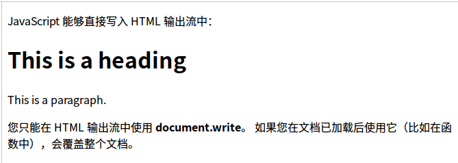

2. 例子二
```
<!DOCTYPE html>
<html>
<body>
<h1>My First Web Page</h1>
<p>My First Paragraph.</p>
<button onclick="myFunction()">点击这里</button>
<script>
function myFunction()
{
document.write("糟糕！文档消失了。");
}
</script>
</body>
</html>
```

结果
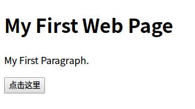

点击
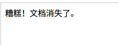

### JavaScript：对事件作出反应
##### 实例
```
<button type="button" onclick="alert('Welcome!')">点击这里</button>
```
alert() 函数在 JavaScript 中并不常用，但它对于代码测试非常方便。
```
<!DOCTYPE html>
<html>
<body>

<h1>我的第一段 JavaScript</h1>

<p>
JavaScript 能够对事件作出反应。比如对按钮的点击：
</p>

<button type="button" onclick="alert('Welcome!')">点击这里</button>

</body>
</html>
```
结果
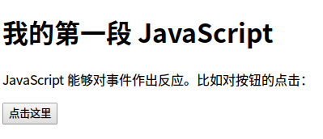

点击
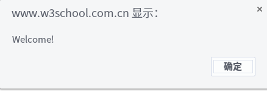

###  JavaScript：改变 HTML 内容
使用 JavaScript 来处理 HTML 内容是非常强大的功能。
##### 实例
```
x=document.getElementById("demo")  //查找元素
x.innerHTML="Hello JavaScript";    //改变内容
```
```
<!DOCTYPE html>
<html>
<body>

<h1>我的第一段 JavaScript</h1>

<p id="demo">
JavaScript 能改变 HTML 元素的内容。
</p>

<script>
function myFunction()
{
x=document.getElementById("demo");  // 找到元素
x.innerHTML="Hello JavaScript!";    // 改变内容
}
</script>

<button type="button" onclick="myFunction()">点击这里</button>

</body>
</html>
```
结果
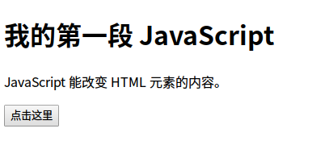

点击


### JavaScript：改变 HTML 图像
##### 实例：会动态地改变 HTML <image> 的来源 (src)：
The Light bulb
```
<!DOCTYPE html>
<html>
<body>
<script>
function changeImage()
{
element=document.getElementById('myimage')
if (element.src.match("bulbon"))
//match() 方法可在字符串内检索指定的值，或找到一个或多个正则表达式的匹配,这里的意思就是图片路径中如果包含“bulbon”这个字符串就执行下面的代码
  {
  element.src="/i/eg_bulboff.gif";
  }
else
  {
  element.src="/i/eg_bulbon.gif";
  }
}
</script>


<p>点击灯泡来点亮或熄灭这盏灯</p>

</body>
</html>
```
结果
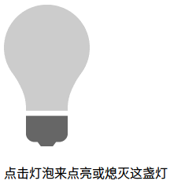

点击
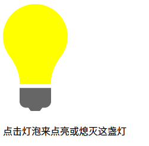

点击灯泡就可以打开或关闭这盏灯

### JavaScript：改变 HTML 样式
##### 实例
```
x=document.getElementById("demo")  //找到元素
x.style.color="#ff0000";           //改变样式
```
```
<!DOCTYPE html>
<html>
<body>

<h1>我的第一段 JavaScript</h1>

<p id="demo">
JavaScript 能改变 HTML 元素的样式。
</p>

<script>
function myFunction()
{
x=document.getElementById("demo") // 找到元素
x.style.color="#ff0000";          // 改变样式
}
</script>

<button type="button" onclick="myFunction()">点击这里</button>

</body>
</html>
```
结果
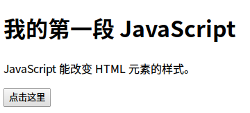

点击
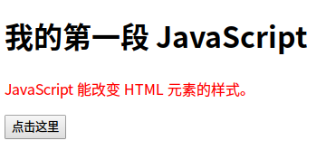

### JavaScript：验证输入
##### 实例
```
if isNaN(x) {alert("Not Numeric")};
```
```
<!DOCTYPE html>
<html>
<body>

<h1>我的第一段 JavaScript</h1>

<p>请输入数字。如果没有输入值或是输入值不是数字，浏览器会弹出提示框。</p>

<input id="demo" type="text">

<script>
function myFunction()
{
var x=document.getElementById("demo").value;
if(x==""||isNaN(x))//isNaN用于指示某个值不是数字
	{
	alert("Not Numeric");
	}
}
</script>

<button type="button" onclick="myFunction()">点击这里</button>

</body>
</html>
```
结果显示
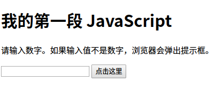

不是数字
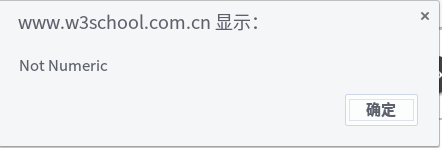
